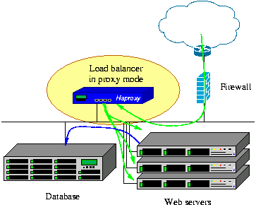

##  高性能负载均衡软件Haproxy 

    1. 四层和七层负载均衡的区别
       所谓的四层就是ISO 参考模型中的第四层。四层负载均衡称为四层交换机，它主要是通过分析 IP层及 TCP/UDP 层的流量实现的基于IP加端口的负载均衡，常见的基于四层的负载均衡有Lvs F5. 
       
       以常见的TCP 应用为例，，负载均衡器在接收到第一个来自客户端的SYN 请求时，会通过设定的负载均衡算法选择一个最佳的后端服务器，同时将报文中目标IP 地址修改为后端服务器IP，然后直接转发给该后端服务器。这样一个负载均衡的请求就完成了。 
       
       
       七层负载均衡器也称为七层交换机，位于OSI最高层，即应用层，此时负载均衡器支持多种应用协议，常见的有HTTP  FTP  SMTP等，七层负载均衡不但可以根据"IP+端口"的方式进行负载分流，还可以根据网站的URL  访问域名   浏览类别   语言等决定负载均衡的策略。 
       
    2. Haproxy 与Lvs 的异同 
       lvs 基于四层IP 负载均衡技术，而haproxy 是基于四层和七层技术，可提供tcp 与http 应用的负载均衡综合解决方案. 
       lvs 工作在iso 模型的第四层，因此其状态监测功能单一，而haproxy 在状态监测方面功能强大，可支持端口、URL  脚本等多种状态监测方式。
       haproxy 虽然功能强大，但是整体处理性能低于四层模式的lvs 负载均衡，而lvs 拥有接近硬件设备的网络吞吐和连接负载能力
       
       
##  安装haproxy  
   下载  [http://www.haproxy.org/ ]()
      
     tar  xvf haproxy-1.8.3.tar.gz
     make TARGET=linux31  
     如果内核为2.6的 那么就是make TARGET=linux26即可
     make install PREFIX=/usr/local/haproxy    安装目录为  /usr/local/haproxy 
     mkdir  /usr/local/haproxy/conf            创建配置文件
     cp examples/option-http_proxy.cfg /usr/local/haproxy/conf/haproxy.cfg   拷贝配置文件
     
## haproxy 结构 
     
   
   
          
## haproxy 配置文件 
    
    Haproxy 配置文件根据功能与用途，主要有5个部分组成，但有些部分并不是必须的，可以根据需要选择相应的部分进行配置。
    
    （1）global部分
        用来设置全局配置参数，属于进程级的配置，通常和操作系统配置有关
        
    （2）default部分
       默认参数的配置部分，在此部分设置的参数值，默认会自动被引用下载的frontend、backend 和listen 部分中，因此在frontend、backend、和listen 部分中也配置了defaults 部分的一样参数，那么defaults部分参数对应的值自动覆盖
     
     (3)frontend 部分
         此部分用于设置接受用户请求的前端虚拟节点。frontend 是在haproxy 1.3 版本之后才引入的组件，同时也引入了backend 组件 ，frontend 可以根据acl 规则直接指定要使用的后端backend 
         
    （4）backend 部分
         此部分用于设置集群后端服务集群的配置，也就是用来添加一组真实服务器，以处理前端用户的请求，添加的真实服务器类似于lvs 中的real  server 节点
     
    （5）listen 部分
         
        此部分是frontend 部分和backend部分的结合体
        
### haproxy配置文件详解
    
    (1) global 部分
        
        
        maxconn         20000
        ulimit-n        16384
        log             127.0.0.1 local0
        uid             200
        gid             200
        chroot          /var/empty
        nbproc          4
        daemon           
         
     maxconn: 设定每个haproxy 进程可接受最大并发连接数，此选项等同于linux 命令行选项"ulimit -n"
     
     uid/gid  设置运行haproxy 进程的用户和组 
     daemon   设置haproxy 进程进入后台运行 
     nbproc   haproxy 启动的时候创建的进程数，一般修改小于服务器CPU 核数，创建多个进程，能够减少每个进程的任务队列，但是过多的进程会导致崩溃
     
   （2）frontend 部分
       
       frontend test-proxy
        bind            192.168.200.10:8080
        mode            http
        log             global
        option          httplog
        option          dontlognull
        option          nolinger
        option          http_proxy
        maxconn         8000
        timeout client  30s 
        
         # layer3: Valid users
        acl allow_host src 192.168.200.150/32
        http-request deny if !allow_host

        # layer7: prevent private network relaying
        acl forbidden_dst url_ip 192.168.0.0/24
        acl forbidden_dst url_ip 172.16.0.0/12
        acl forbidden_dst url_ip 10.0.0.0/8
        http-request deny if forbidden_dst

        default_backend test-proxy-srv

        
        这部分通过frontend 关键字起一个名为“test-proxy” 的前端虚拟节点，
        bind: 此选项只能在frontend 和listen 部分进行定义，用于定义或几个监听的套接字     
        mode 设置haproxy 实例默认的运行模式，有tcp  http 模式 
        
        option  httplog: 在默认情况下，haproxy 日志是不记得HTTP请求的，这样很不方便haproxy 问题的排查与监控，通过此选项可以启用日志记录HTTP 请求 
        option  forwardfor: 如果后端服务器需要获得客户端的真实IP，就需要配置此参数，由于haproxy 工作于反向代理模式，因此发往后端真实服务器的请求中客户端IP haproxy 主机的ip，而非真实访问客户端的地址，这就导致真实服务器无法记录客户端真正请求来源的ip，而“x-forwarded-for” 则可用于解决此问题。 
        
        tcp 模式: 在此模式下，客户端和服务器端之间将建立一个全双工的连接，不会对七层报文做任何类型的检查，经常用于SSL  SSH SMTP 等应用 
        
        http模式: 在此模式下，客户端请求在转发至后端服务器之前将会被深度分析，所有不与RFC 格式兼容的请求都会被拒绝。
        
        timeout client: 设置连接客户端发送数据时最长等待时间，默认单位为毫秒
        
        log  global:表示使用全局的日志配置，这里的"global" 表示引用在haproxy 配置文件global 部分中定义的log 选项配置格式。
        
        default_backend: 指定默认的后端服务器池，也就是指定一组后端真实服务器，而这些真实服务器组将在backend 段进行定义。这里test-proxy-srv 就是后端服务器组
        
     （3）backend 部分
        backend test-proxy-srv
        mode            http
        timeout connect 5s
        timeout server  5s
        retries         2
        option          nolinger
        option          http_proxy

        # layer7: Only GET method is valid
        acl valid_method        method GET
        http-request deny if !valid_method

        # layer7: protect bad reply
        http-response deny if { res.hdr(content-type) audio/mp3 }
        
        
        option   abortonclose: 如果设置了此参数，可以在服务器负载很高的情况下，自动结束掉当前队列中处理时间比较长的链接  
        
        
        balance: 此关键字用来定义负载均衡算法.目前haproxy 支持多种负载均衡算法，常用的有如下几种: 
        
        rundrobin: 基于权重进行轮询调度的算法，在服务器性能分布比较均匀的时候，也是一种最公平、最合理的算法.此算法经常使用 
        
        source: 用基于请求源IP 的算法，此算法先对请求的源IP 进行hash 运算，然后将结果与后端服务器的权重总数相除后转发至某个匹配的后端服务器。这种方式可以使同一个客户端的请求始终被转发到特定的后端服务器。
        
        leastconn: 此算法会将新的连接请求转发到具有最少连接数目的后端服务器，在回话时间较长的场景中推荐此算法，例如数据库负载均衡，不太适合基于http 的应用
        
        uri:此算法会对部分或整个URI 进行hash 运算，再经过与服务器的总权重相除，最后转发到某台匹配的后端服务器上。
   
        uri_param: 此算法会根据URL 路径中参数进行转发     
        static-dir: 也是基于权重进行轮询的调度算法，不过此算法为静态方法，在运行时调整其服务器权重不会生效 
        
        cookie:表示运行向cookie 插入SERVERID每台服务器的SERVERID 
        
        (
        
        
        
        
        
        
        
        
        
        
        
        
        
        
        
        
      
            
         
         
         
         
         
         
         
         
         
          
    
    
    
        
            
       