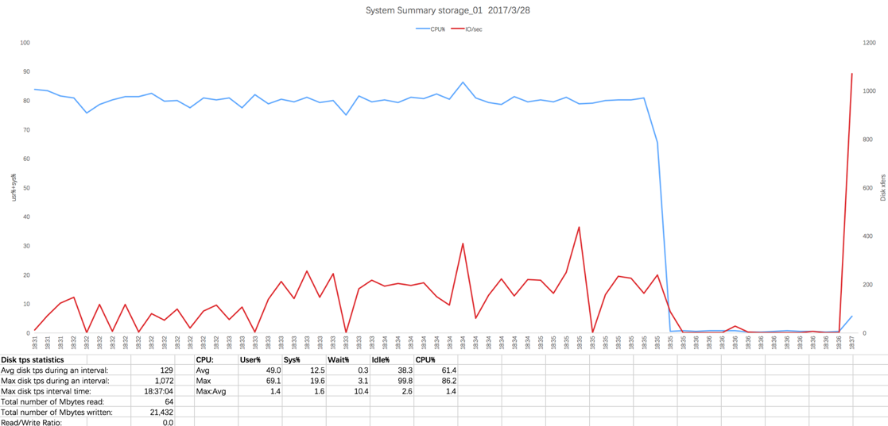
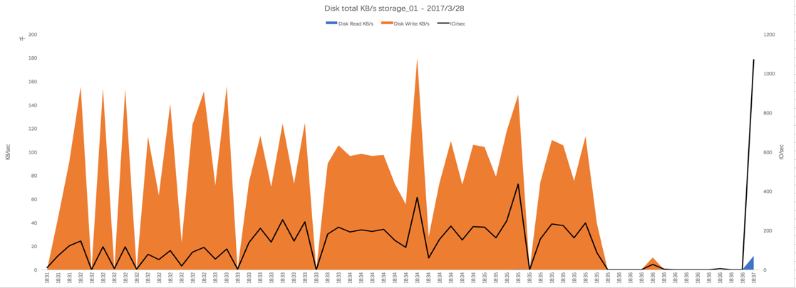
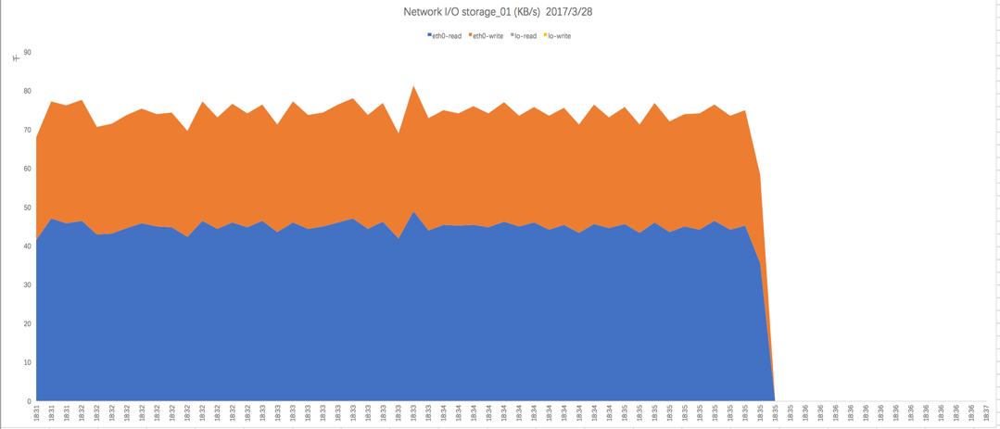

## centos  leofs 配置

#### 1. leofs  cluster  基本规划
     Manager
     IP: 10.39.1.23, 10.39.1.24
     Name: manager_0@10.39.1.23, manager_1@10.39.1.24
     Gateway
     IP: 10.39.1.28
     Name: gateway_0@10.39.1.28
     Storage
     IP: 10.39.1.25 .. 10.39.1.26  ... 10.39.1.27
     Name: storage_01@10.39.1.25 .. storage_02@10.39.1.26...storage_02@10.39.1.27

#### 2 leofs 介绍 
    LeoFS是一个非结构化的Web对象存储和高可用的，分布式的，最终一致的存储系统

     10.39.1.23   c6qPkWB9sCk8

#### 3 安装部署  
    10.39.1.23 上配置 
     1.机器列表
       修改主机名以及hosts 
       10.39.1.23       leofs_01 
       10.39.1.24       leofs_02 
       10.39.1.25       storage_01 
       10.39.1.26       storage_02 
       10.39.1.27       storage_03 
       10.39.1.28       gw_01 
  
     2.安装ansible
       
     yum install epel-release -y 
     yum install ansible -y
     3.配置ansible
     
     vim  /etc/ansible/hosts  
     
     4.编辑所有服务器配置主机名
      vim /etc/hostname 
      vim /etc/hosts 
    
     5.生成key  
       ssh-keygen   

       ansible 推送key 到其他服务器
       ansible all -m authorized_key -a "user=root  key='{{ lookup('file','~/.ssh/id_rsa.pub')}}'"  

    6.安装依赖的软件包 
    ansible leofs -m shell -a "yum install gcc gcc-c++ glibc-devel make ncurses-devel     openssl-devel autoconf  libuuid-devel cmake check check-devel   wget curl git gcc* vim nc -y " 
   
    7.验证 
     ansible leofs -m shell  -a "hostname" 
     ansible leofs -m shell  -a "cat /etc/hosts"   

    8.下载leofs 包 
     http://leo-project.net/leofs/download.html  
     下载centos 7 1.3.2.1 最新rpm包
     将rpm copy 到其他服务器
     ansible all -m copy -a 'src=~/leofs-1.3.2.1-1.erl-18.3.el7.x86_64.rpm dest=/opt' 
     ansible all -m shell -a 'ls -l /opt'   
     ansible all -m shell -a 'cd /opt/; yum install leofs-1.3.2.1-1.erl-18.3.el7.x86_64.rpm -y'  

##### 3.1  存储节点安装
    
    ansible leofs_storage -m shell -a "yum --enablerepo=centosplus install kmod-xfs xfsprogs xfsprogs-devel -y"

     1. 查看安装目录是否全部安装
     ansible all -m shell -a 'ls -l /usr/local/leofs'   

  
#### 4 配置leofs  
    
#####  10.39.1.23  配置manger0 

      manager0 中会配置一致性的级别和集群的id 以及名称
    1. leofs 一致性级别配置参考
      相关资料参考 http://leo-project.net/leofs/docs/configuration/configuration_1.html#system-configuration-label  
    A reference consistency level
    Level	Configuration
    Low	n = 3, r = 1, w = 1, d = 1
    Middle	n = 3, [r = 1 | r = 2], w = 2, d = 2
    High	n = 3, [r = 2 | r = 3], w = 3, d = 3

     2. 编辑文件 
    cp /usr/local/leofs/1.3.2.1/leo_manager_0/etc/leo_manager.conf /usr/local/leofs/1.3.2.1/leo_manager_0/etc/leo_manager.conf.bak 
    vim  /usr/local/leofs/1.3.2.1/leo_manager_0/etc/leo_manager.conf

    manager.partner = manager_1@10.39.1.24
 
    system.dc_id = dc_1
    system.cluster_id = leofs_cluster    # 集群名字
    consistency.num_of_replicas = 3      # 集群的副本集
    consistency.write = 1
    consistency.read = 1
    consistency.delete = 1
    consistency.rack_aware_replicas = 0
    nodename = manager_0@10.39.1.23

#####  10.39.1.24 manger1 配置
    1. 编辑文件
     cp /usr/local/leofs/1.3.2.1/leo_manager_1/etc/leo_manager.conf /usr/local/leofs/1.3.2.1/leo_manager_1/etc/leo_manager.conf.bak 
     vim  /usr/local/leofs/1.3.2.1/leo_manager_1/etc/leo_manager.conf  
        manager.partner = manager_0@10.39.1.23 
        nodename = manager_1@10.39.1.24
        
#####  10.39.1.25 storage_01配置 

    返回到10.39.1.23 上使用ansible 对配置文件进行备份
    ansible leofs_storage -m shell -a "cp /usr/local/leofs/1.3.2.1/leo_storage/etc/leo_storage.conf /usr/local/leofs/1.3.2.1/leo_storage/etc/leo_storage.conf.bak "  

    1. leofs 建议使用xfs，因为xfs I/O对大文件支持比较好 
        添加一块硬盘并且格式化为xfs 文件系统

        fdisl /dev/vdc   
        n
        p
        w

       mkfs.xfs /dev/vdc1
       添加到fstab 
       vim  /etc/fstab 
       /dev/sda3   /mnt/xfs   xfs   noatime,nodiratime,osyncisdsync 0 0  
       vim   /usr/local/leofs/1.3.2.1/leo_storage/etc/leo_storage.conf
       managers = [manager_0@10.39.1.23, manager_1@10.39.1.24]
       obj_containers.path = [/data/leofs]
       obj_containers.num_of_containers = [8]
       
######  读写参数的一些设置  
      磁盘的一些设置
      ##  Watchdog.DISK
      ## Is disk-watchdog enabled - default:false
      watchdog.disk.is_enabled = false
      ## disk - raised error times
      watchdog.disk.raised_error_times = 5

      ## disk - watch interval - default:1sec
      watchdog.disk.interval = 10

      ## Threshold use(%) of a target disk's capacity - defalut:85%
      watchdog.disk.threshold_disk_use = 85

	   ## Threshold disk utilization(%) - defalut:90% 
      watchdog.disk.threshold_disk_util = 90

     ## Threshold disk read kb/sec - defalut:98304(KB) = 96MB
     #watchdog.disk.threshold_disk_rkb = 98304
     #131072kb=128MB
     watchdog.disk.threshold_disk_rkb = 131072

    ## Threshold disk write kb/sec - defalut:98304(KB) = 96MB
    #watchdog.disk.threshold_disk_wkb = 98304
    #131072(kb)=128MB
    watchdog.disk.threshold_disk_wkb = 131072

    nodename = storage_01@10.39.1.25 

    配置也可以参考 
    leofs 存储默认可以设置多个
    ## e.g. Case of plural pathes
    ## obj_containers.path = [/var/leofs/avs/1, /var/leofs/avs/2]
    ## obj_containers.num_of_containers = [32, 64] 

##### 10.39.1.26   storage02 配置

    mkfs.xfs /dev/vdc1
    vim  /usr/local/leofs/1.3.2.1/leo_storage/etc/leo_storage.conf 

    managers = [manager_0@10.39.1.23, manager_1@10.39.1.24]
    obj_containers.path = [/data/leofs]
    obj_containers.num_of_containers = [8]

    nodename = storage_02@10.39.1.26

##### 10.39.1.27   storage03 配置

    mkfs.xfs /dev/vdc1   

    vim   /usr/local/leofs/1.3.2.1/leo_storage/etc/leo_storage.conf 

    managers = [manager_0@10.39.1.23, manager_1@10.39.1.24]
    obj_containers.path = [/data/leofs]
    obj_containers.num_of_containers = [8]

    nodename = storage_03@10.39.1.27

##### 10.39.1.23 
    返回到10.39.1.23 上使用ansible 批量执行

    ansible leofs_storage -m shell -a "mkdir /data/leofs -p "

    ansible leofs_storage -m shell -a "ls /data/" 

    ansible leofs_storage -m shell -a "mount /dev/vdc1 /data/leofs" 

    ansible leofs_storage -m shell -a "df -h"

    echo "/dev/vdc1   /data/leofs   xfs        noatime,nodiratime,osyncisdsync 0 0"   >> /etc/fstab   

    ansible leofs_storage -m shell -a 'echo "/dev/vdc1   /data/leofs   xfs   noatime,nodiratime,osyncisdsync 0 0"   >> /etc/fstab'

    将storage01 02  03 重启   
    查看存储是否挂载成功
     ansible leofs_storage -m shell -a "df -h"  

#####  gw_01 10.39.1.28 配置

     网关配置协议  端口   网关的缓存大小 
     vim   /usr/local/leofs/1.3.2.1/leo_gateway/etc/leo_gateway.conf  
     managers = [manager_0@10.39.1.23, manager_1@10.39.1.24]
     protocol = s3
     http.port = 8080
     cache.cache_ram_capacity = 268435456
     cache.cache_disc_capacity = 0
     cache.cache_expire = 300
     cache.cache_max_content_len = 1048576
     nodename = gateway_01@10.39.1.28

    # 网关配置线程池 
    ## Large Object Handler - put worker pool size
    large_object.put_worker_pool_size = 64

    ## Large Object Handler - put worker buffer size
    large_object.put_worker_buffer_size = 32
    ## Memory cache capacity in bytes
    cache.cache_ram_capacity = 0

    ## Disk cache capacity in bytes
    cache.cache_disc_capacity = 0

    ## When the length of the object exceeds this value, store the object on disk
    cache.cache_disc_threshold_len = 1048576

    ## Directory for the disk cache data
     cache.cache_disc_dir_data = ./cache/data

    ## Directory for the disk cache journal
    cache.cache_disc_dir_journal = ./cache/journal

#### 启动顺序 

    Order of server launch
    Manager-master
    Manager-slave
    Storage nodes
    Gateway(s)

 
    10.39.1.23  manager0 
    /usr/local/leofs/1.3.2.1/leo_manager_0/bin/leo_manager start   
    /usr/local/leofs/1.3.2.1/leo_manager_0/bin/leo_manager ping  
    pong  
    10.39.1.24  manager1 
    /usr/local/leofs/1.3.2.1/leo_manager_1/bin/leo_manager start  
    /usr/local/leofs/1.3.2.1/leo_manager_1/bin/leo_manager ping 
    pong

    10.39.1.25  storage01 
    /usr/local/leofs/1.3.2.1/leo_storage/bin/leo_storage start  
    /usr/local/leofs/1.3.2.1/leo_storage/bin/leo_storage ping 
    pong

    10.39.1.26  storage02 
    /usr/local/leofs/1.3.2.1/leo_storage/bin/leo_storage start 
    /usr/local/leofs/1.3.2.1/leo_storage/bin/leo_storage ping 
    pong

    10.39.1.27  storage03 
    /usr/local/leofs/1.3.2.1/leo_storage/bin/leo_storage start 
    /usr/local/leofs/1.3.2.1/leo_storage/bin/leo_storage ping 
    pong
 

#####  启动状态验证 
     
     查看存储的启动信息
    ansible leofs_storage -m shell -a "ls -l /data/leofs"
     10.39.1.26 | SUCCESS | rc=0 >> 
     总用量 12
    drwxr-xr-x  2 root root 4096 3月  30 16:00 log
    drwxr-xr-x 10 root root 4096 3月  30 15:24 metadata
    drwxr-xr-x  2 root root  310 3月  30 15:18 object
    drwxr-xr-x  2 root root 4096 3月  30 15:24 state

    10.39.1.25 | SUCCESS | rc=0 >>
    总用量 12
    drwxr-xr-x  2 root root 4096 3月  30 16:00 log
    drwxr-xr-x 10 root root 4096 3月  30 15:23 metadata
    drwxr-xr-x  2 root root  310 3月  30 15:04 object
    drwxr-xr-x  2 root root 4096 3月  30 15:23 state

    10.39.1.27 | SUCCESS | rc=0 >>
    总用量 4
    drwxr-xr-x  2 root root 4096 3月  30 16:00 log
    drwxr-xr-x 10 root root  246 3月  30 15:19 metadata
    drwxr-xr-x  2 root root  310 3月  30 15:19 object

    在10.39.1.23 上执行查看集群的状态

    集群的状态查询是经过nmap 通信查询的， 需要在各个节点下安装nc 

    ansible leofs -m shell -a "yum install nc -y "  

    /usr/local/leofs/1.3.2.1/leofs-adm status

    /usr/local/leofs/1.3.2.1/leofs-adm status 
    [System Confiuration]
    -----------------------------------+----------
     Item                              | Value    
    -----------------------------------+----------
    Basic/Consistency level
    -----------------------------------+----------
                    system version | 1.3.2
                        cluster Id | leofs_cluster
                             DC Id | dc_1
                    Total replicas | 3
          number of successes of R | 1
          number of successes of W | 1
          number of successes of D | 1
    number of rack-awareness replicas | 0
                         ring size | 2^128
    -----------------------------------+----------
       Multi DC replication settings
     -----------------------------------+----------
        max number of joinable DCs | 2
           number of replicas a DC | 1
    -----------------------------------+----------
     Manager RING hash
    -----------------------------------+----------
                 current ring-hash | 
                previous ring-hash | 
    -----------------------------------+----------

    [State of Node(s)]
    -------+----------------------------+--------------+---------------- +----------------+----------------------------
    type  |            node            |    state     |  current ring  |   prev ring    |          updated at         
     -------+----------------------------+--------------+----------------+----------------+----------------------------
    S    | storage_01@10.39.1.25      | attached     |                |                 | 2017-03-30 15:24:56 +0800
    S    | storage_02@10.39.1.26      | attached     |                |                | 2017-03-30 15:24:43 +0800
    S    | storage_03@10.39.1.27      | attached     |                |                | 2017-03-30 15:19:22 +0800
    -------+----------------------------+--------------+----------------

    启动网关
    10.39.1.28  
   
    /usr/local/leofs/1.3.2.1/leo_gateway/bin/leo_gateway start  

    /usr/local/leofs/1.3.2.1/leo_gateway/bin/leo_gateway ping  
    pong

    存储驱动启动
    10.39.1.23 leofs

    /usr/local/leofs/1.3.2.1/leofs-adm start 
    Generating RING...
    Generated RING
    OK  33% - storage_01@10.39.1.25
    OK  67% - storage_03@10.39.1.27
    OK 100% - storage_02@10.39.1.26
    OK

    /usr/local/leofs/1.3.2.1/leofs-adm status 
    [System Confiuration]
    -----------------------------------+----------
    Item                              | Value    
    -----------------------------------+----------
     Basic/Consistency level
    -----------------------------------+----------
                    system version | 1.3.2
                        cluster Id | leofs_cluster
                             DC Id | dc_1
                    Total replicas | 3
          number of successes of R | 1
          number of successes of W | 1
          number of successes of D | 1
    number of rack-awareness replicas | 0
                         ring size | 2^128
    -----------------------------------+----------
     Multi DC replication settings
    -----------------------------------+----------
        max number of joinable DCs | 2
           number of replicas a DC | 1
    -----------------------------------+----------
    Manager RING hash
    -----------------------------------+----------
                 current ring-hash | 
                previous ring-hash | 
     -----------------------------------+----------

     [State of Node(s)]
     -------+----------------------------+--------------+----------------  +----------------+----------------------------
     type  |            node            |    state     |  current ring  |     prev ring    |          updated at         
    -------+----------------------------+--------------+----------------
     S    | storage_01@10.39.1.25      | running      | 79e0dbc4       | 79e0dbc4       | 2017-03-30 15:29:17 +0800
     S    | storage_02@10.39.1.26      | running      | 79e0dbc4       | 79e0dbc4       | 2017-03-30 15:29:17 +0800
     S    | storage_03@10.39.1.27      | running      | 79e0dbc4       | 79e0dbc4       | 2017-03-30 15:29:17 +0800
     G    | gateway_01@10.39.1.28      | running      | 79e0dbc4       | 79e0dbc4       | 2017-03-30 15:29:18 +0800
    -------+----------------------------+--------------+----------------

#### leofs 对象存储的配置和查询 

    s3-api 命令使用
  [http://leo-project.net/leofs/docs/admin_guide/admin_guide_8.html]()

    用户查询
    get-users
    /usr/local/leofs/1.3.2.1/leofs-adm get-users
    user_id     | role_id | access_key_id          | created_at                
    ------------+---------+------------------------+---------------------------
    _test_leofs | 9       | 05236                  | 2017-03-30 15:03:54 +0800

    删除默认的用户
    delete-user <user-id>
    /usr/local/leofs/1.3.2.1/leofs-adm delete-user _test_leofs 
    OK

    创建用户
    create-user <user-id> <password>

    /usr/local/leofs/1.3.2.1/leofs-adm create-user test test
    access-key-id: 919ca38e3fb34085b94a
    secret-access-key: 387d7f32546982131e41355e1adbcae1a9b08bec

    /usr/local/leofs/1.3.2.1/leofs-adm get-users
    user_id | role_id | access_key_id          | created_at                
    --------+---------+------------------------+---------------------------
     test    | 1       | 919ca38e3fb34085b94a   | 2017-03-30 15:45:41 +0800

    endpoint  
    /usr/local/leofs/1.3.2.1/leofs-adm add-endpoint 10.39.1.28
    OK

    /usr/local/leofs/1.3.2.1/leofs-adm get-endpoints
    endpoint         | created at                
    -----------------+---------------------------
    10.39.1.28       | 2017-03-30 15:49:14 +0800
    localhost        | 2017-03-30 15:03:54 +0800
    s3.amazonaws.com | 2017-03-30 15:03:54 +0800

    add-bucket <bcuket> <access-key-id>

    /usr/local/leofs/1.3.2.1/leofs-adm add-bucket abc 919ca38e3fb34085b94a
    OK

    /usr/local/leofs/1.3.2.1/leofs-adm get-buckets
    cluster id    | bucket   | owner  | permissions      | redundancy method            | created at                
    --------------+----------+--------+------------------+------------------------------+---------------------------
    leofs_cluster | abc      | test   | Me(full_control) | copy, {n:3, w:1, r:1, d:1}   | 2017-03-30 15:51:43 +0800

    get-bucket <access-key-id>

    权限
    /usr/local/leofs/1.3.2.1/leofs-adm  update-acl abc 919ca38e3fb34085b94a    public-read-write
    OK

    查看存储节点的磁盘信息
    /usr/local/leofs/1.3.2.1/leofs-adm  du detail storage_01@10.39.1.25

    /usr/local/leofs/1.3.2.1/leofs-adm  status  storage_01@10.39.1.25
    

#### 性能压测
    leofs 性能测试工具  basho_bench 
[https://github.com/basho/basho_bench]()

    10.39.1.23  安装
    安装性能测试工具
    git clone https://github.com/leo-project/basho_bench.git
    cd basho_bench/ 
    make all 
    # make all 的时候使用的git 有时候拉取依赖会报错，使用https 就好
    批量替换git deps 目录下的所有的rebar.confg 配置文件git 修改为https 
     find deps -name rebar.config -type f -exec sed -i 's/git:\/\//https:\/\//g' {} + 
     make all  

     性能压测测试文件  
     16kb 文件压测
     vim   16file.conf   
     {mode,      max}.
     {duration,   10}.
     {concurrent, 50}.

     {driver, basho_bench_driver_leofs}.
     {code_paths, ["deps/ibrowse"]}.

     {http_raw_ips, ["10.39.1.28"]}. %% able to set plural nodes
     {http_raw_port, 8080}. %% default: 8080
     {http_raw_path, "/abc"}.
     %% {http_raw_path, "/${BUCKET}"}.

     {key_generator,   {partitioned_sequential_int, 660000}}. %% 请求的次数
     {value_generator, {fixed_bin, 16384}}. %% 16KB
     {operations, [{put,1}]}.               %% PUT:100%
     %%{operations, [{put,1}, {get, 4}]}.   %% PUT:20%, GET:80%

     {check_integrity, false}.

     660000x16kb=10GB  

     安装nmon 收集信息
     ansible leofs -m shell -a "yum install wget https://raw.githubusercontent.com/hambuergaer/nmon-packages/master/nmon-rhel7-1.0-1.x86_64.rpm -y " 

     ansible leofs -m shell -a "mkdir /nmon "   

     10 分钟 
     nmon 使用参数 
     -s  表示秒级采集一次数据
     -c  表示采集收的次数
     -m  表示生成数据文件的路径
     -f  表示生成数据文件名中有时间

    nmon  -f  -s 1 -c 360 -m /nmon  

    一秒采集一次，总共采集6分钟，1x360/3600=6分钟  

    先检查一下磁盘的大小
    [root@leofs_01 basho_bench]# ansible leofs_storage -m shell -a  "du -sh  /data/leofs "
    10.39.1.26 | SUCCESS | rc=0 >>
    332K	/data/leofs

    10.39.1.25 | SUCCESS | rc=0 >>
    332K	/data/leofs

    10.39.1.27 | SUCCESS | rc=0 >>
    132K	/data/leofs

    同时写入9.7GB 16KB大小的文件 ，用时5分钟 
    用时5分钟
    ansible leofs_storage -m shell -a  "du -sh /data/leofs "
    10.39.1.26 | SUCCESS | rc=0 >>
    9.7G	/data/leofs

    10.39.1.25 | SUCCESS | rc=0 >>
    9.7G	/data/leofs

    10.39.1.27 | SUCCESS | rc=0 >>
    9.7G	/data/leofs
    
  性能指标
   CPU/IO 性能指标 
  
    
   磁盘指标  
  
  
   网卡读写
   
   
  
     这里只列出了storage1 的性能指标，其他storgae2 和storge3 指标未在这里列出来

#####  把网关的线程池打开设置为64  
    # 网关配置线程池 
    ## Large Object Handler - put worker pool size
    large_object.put_worker_pool_size = 16

    ## Large Object Handler - put worker buffer size
    large_object.put_worker_buffer_size = 32
    ## Memory cache capacity in bytes
    cache.cache_ram_capacity = 0

    ## Disk cache capacity in bytes
    cache.cache_disc_capacity = 0

    ## When the length of the object exceeds this value, store the object on disk
    cache.cache_disc_threshold_len = 1048576

    ## Directory for the disk cache data
    cache.cache_disc_dir_data = ./cache/data

    ## Directory for the disk cache journal
    cache.cache_disc_dir_journal = ./cache/journal

    10万 文件用时一分钟 使用比例如下

    4096.. 8192: 15%
    8192.. 16384: 25%
    16384.. 32768: 23%
    32768.. 65536: 22%
    65536.. 131072: 15%

    {mode, max}.
    {duration, 1000}.
    {concurrent, 64}.

    {driver, basho_bench_driver_leofs}.
    {code_paths, ["deps/ibrowse"]}.

    {http_raw_ips, ["10.39.1.28"]}.
    {http_raw_port, 8080}.
    {http_raw_path, "/abc"}.

    {retry_on_overload, true}.
    {key_generator, {partitioned_sequential_int, 1000000}}.
    {value_generator, {fixed_bin, 262144}}.
    {operations, [{put,1}]}.
    {value_generator_source_size, 1048576}.
    {http_raw_request_timeout, 30000}. % 30seconds
    {value_size_groups, [{15, 4096, 8192},{25, 8192, 16384}, {23, 16384, 32768}, {22, 32768, 65536}, {15, 65536, 131072}]}.

    
#### 安装web 界面

    10.39.1.23 安装LeoCenter 
    git clone https://github.com/leo-project/leo_center.git
    yum install ruby-devel -y
    cd leo_center/
    gem install bundler  
    bundle install 

    修改配置
     config.yml

     :managers:
     - "localhost:10020" # master
     - "localhost:10021" # slave
    :credential:
      :access_key_id: "YOUR_ACCESS_KEY_ID"
      :secret_access_key: "YOUR_SECRET_ACCESS_KEY"

     启动服务
      thin start -a ${HOST} -p ${PORT} > /dev/null 2>&1  &  
 
 
     创建管理员
      You need to create an administrator user from LeoFS-Manager’s console.
    $ leofs-adm create-user leo_admin password
         access-key-id: ab96d56258e0e9d3621a
         secret-access-key: 5c3d9c188d3e4c4372e414dbd325da86ecaa8068

     $ leofs-adm update-user-role leo_admin 9
       OK

     leofs-adm create-user leo_admin password 
         access-key-id: 8d9de6fdfb35f837e9ed
         secret-access-key: 7dcc2631493865c7fb7ec7f96dda627f1cbb21eb
   
     leofs-adm update-user-role leo_admin 9 
      OK
      
     [root@leofs_01 leo_center]# leofs-adm get-users
      user_id   | role_id | access_key_id          | created_at                
      ----------+---------+------------------------+---------------------------
      leo_admin | 9       | 8d9de6fdfb35f837e9ed   | 2017-03-31 11:40:14 +0800
       test      | 1       | 919ca38e3fb34085b94a   | 2017-03-30 15:45:41 +0800

    经过测试。  
    删除用户buckets 是存在的，只有当buckets 删除之后数据才能真正删除  

